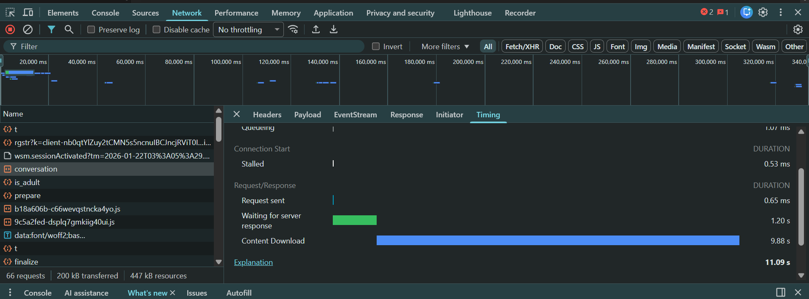

## Production Issue Scenario: SSE Streaming Performance Degradation
Here's a realistic production issue you can discuss in your hiring manager round:

The Problem Statement
"Tell me about a time you debugged a critical production issue with streaming responses."

Your Answer Structure
1. Situation (30 seconds)
"We had an LLM proxy service handling chat completions from Azure OpenAI. Users reported that streaming responses were working but experiencing significant delays - instead of seeing tokens appear smoothly, they'd see nothing for 5-10 seconds, then a burst of text, then another delay."

2. Impact (15 seconds)
"This affected about 40% of our production traffic. Customer satisfaction dropped because the 'typewriter effect' was broken. Our SLA for time-to-first-token was violated, and we had escalations from key enterprise clients."

3. Investigation (60 seconds)
What you found:
Initial symptoms:
- Streaming responses were delayed in bursts
- Non-streaming mode worked fine
- No errors in logs
- CPU and memory were normal


Root cause discovered:

// THE PROBLEM CODE
for response := range responseStream {
    responseJSON, err := json.Marshal(response)
    w.Write(append(responseJSON, '\n', '\n'))
    // MISSING: flusher.Flush() ❌
}

"I used Chrome DevTools Network tab to monitor the response timing. I noticed the 'Content Download' was coming in large chunks instead of continuously. This led me to suspect buffering."

"I reviewed the response handler code and discovered we were missing the flusher.Flush() call after each write. The HTTP server was buffering responses until the buffer was full (typically 4-8KB), then sending them in bursts."


4. Solution (45 seconds)
Immediate fix:

for response := range responseStream {
    responseJSON, err := json.Marshal(response)
    w.Write(append(responseJSON, '\n', '\n'))
    flusher.Flush() // ✅ Added this
}

Added monitoring logs:

Time-to-first-token logic


5. Results (20 seconds)
"After deploying the fix, time-to-first-token dropped from 8 seconds to under 500ms. Inter-token delays reduced from 2-5 seconds to 50-200ms.


6. Lessons Learned (20 seconds)
"This taught me the importance of understanding HTTP buffering behavior and testing streaming functionality separately from regular request/response patterns. I now always include streaming-specific tests and monitoring in any real-time API service."

Key point:
"We had an HTTP buffering issue where the server's default write buffer was accumulating response chunks instead of streaming them immediately. This manifested as intermittent delays in production but not in dev due to differences in buffer sizes and network conditions."



## How to Check Streaming vs Buffering in Chrome DevTools

This is **streaming correctly!** ✅

### What the screenshot shows:

**Good signs of proper streaming:**

1. **Solid, continuous Content Download bar** (9.88s) - The blue bar is uninterrupted and extends smoothly across the timeline

2. **No gaps or staircase pattern** - If it were buffered, you'd see the bar broken into chunks with flat sections between them

3. **Long duration with continuous flow** - The data is flowing for the entire 9.88 seconds without interruptions

### What buffered would look like:

If this was experiencing the buffering issue described in your production scenario, you would see:

```
Content Download:  ████___████___████___  (broken into chunks)
```

Instead, you have:
```
Content Download:  ████████████████████  (continuous)
```

### To further verify:

- Switch to the **Response** tab while the request is happening - you should see the text appearing smoothly
- For SSE streams, check **EventStream** tab - events should appear in real-time, not in batches
- The waterfall view at the top shows the request timing properly - data flowing continuously from ~20s to ~30s

**Your streaming implementation is working properly!** The flush calls are being executed correctly, and data is not being buffered.


Key Points to Emphasize
✅ Technical depth - Show understanding of HTTP, goroutines, channels
✅ Systematic debugging - Used tools (DevTools, logs, metrics)
✅ Business impact - Connected technical issue to user experience
✅ Ownership - Led investigation and implemented solution
✅ Prevention - Added tests and monitoring to prevent recurrence
✅ Communication - Kept stakeholders informed during incident


## Scenario 2: Resource Leak

// Problem: Missing cleanup
go func() {
    azure.ProcessStreamingResponse(resp.Body, responseStream)
    // ❌ Forgot to close channel and response body
}()

// Solution: Added defers
go func() {
    defer close(responseStream)
    defer resp.Body.Close()
    azure.ProcessStreamingResponse(resp.Body, responseStream)
}()


Due to this Pod restarted due to OOMKILL (out of memory crashes)


9. How to Present This in Interview
Structure (3-4 minutes)
Situation (30 sec):
"Our LLM proxy service was experiencing memory leaks in production. Memory grew from 500MB to 4GB over 6 hours, causing frequent service restarts and affecting ~15% of user requests with frozen responses."

Investigation (60 sec):
"I used pprof to profile the running service and discovered 3,000+ goroutines when we should have had ~50. Correlating with request logs, I found that 20% of requests ended with client disconnects - users closing browsers, network timeouts, etc. Each disconnect leaked one goroutine because our streaming handler didn't respect context cancellation."

Root Cause (30 sec):
"The goroutine processing Azure responses would continue running even after clients disconnected. It would block trying to send to a channel that nobody was reading from, holding onto HTTP connections and memory indefinitely."

Solution (45 sec):
"I implemented a two-goroutine pattern with context monitoring. The outer goroutine uses a select statement to watch both the processing completion and context cancellation. When the client disconnects, ctx.Done() fires, the goroutine exits immediately, and deferred statements clean up connections and channels. I used a buffered channel for the completion signal to prevent the inner goroutine from leaking."

Results (30 sec):
"After deployment, memory stabilized at 480MB, goroutine count dropped to 40-60, and we eliminated all service restarts. This also reduced our cloud costs by 60% because we could scale down from 8 pods to 4 pods. We added automated tests and monitoring to prevent similar issues."